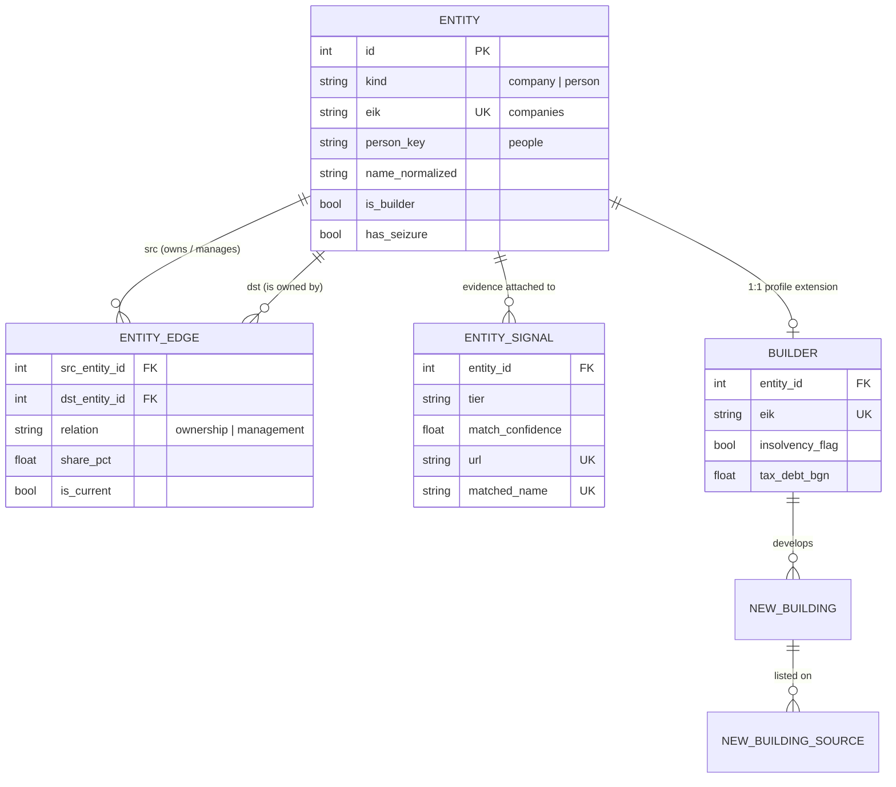
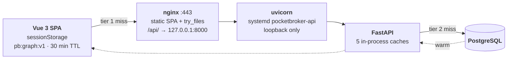

# PocketBroker — Bulgarian Real Estate Intelligence

A full-stack platform that answers a question public listing sites cannot: **who is actually
behind the building you are about to buy into?**

It combines two datasets that normally live apart — property market prices, and the corporate
ownership graph of the developers who build them — so a flat can be traced to its project, to
its developer, to that developer's owners, and to any court records naming them.

**Stack:** Python 3 crawlers (`httpx` + `beautifulsoup4`) → JSONL → ETL → PostgreSQL → FastAPI +
SQLAlchemy 2 → Vue 3 + Vite + Pinia + Leaflet + D3.

> **This is a redacted public mirror** of a private working repository. The code, schema, pipeline
> and tests are intact; completed research naming private individuals is not. See
> [REDACTIONS.md](REDACTIONS.md).

---

## Table of contents

- [What it does](#what-it-does)
- [Architecture at a glance](#architecture-at-a-glance)
- [The crawlers](#the-crawlers)
- [How data is stored](#how-data-is-stored)
- [The developer graph](#the-developer-graph)
- [Serving & caching](#serving--caching)
- [Deployment](#deployment)
- [Running it](#running-it)
- [Design decisions worth defending](#design-decisions-worth-defending)

---

## What it does

| Feature | Detail |
|---|---|
| Price history | 4 cities (Sofia, Plovdiv, Varna, Burgas), 31 years of October snapshots, **sale and rent**, by neighbourhood and property type |
| Interactive map | Leaflet, neighbourhood bubbles driven by a selectable metric and year |
| Developer research | Ownership graph traced through the official commercial register, incl. per-project SPVs |
| Court signals | Company/person matches against the national court-acts portal, tiered by confidence |
| Air quality | PM2.5 / AQI per neighbourhood, per year, per season |
| Real-terms pricing | Gold and minimum-wage series to deflate nominal prices |
| i18n | Bulgarian / English, Bulgarian default; database content stays Cyrillic |

---

## Architecture at a glance

```mermaid
flowchart LR
  subgraph SRC["Public sources"]
    direction TB
    S1["imot.bg<br/>prices"]
    S2["Търговски регистър<br/>companies + owners"]
    S3["legalacts.justice.bg<br/>court acts"]
    S4["novitesgradi /<br/>bulgarianproperties"]
    S5["OSM Nominatim<br/>+ Overpass"]
    S6["AQICN /<br/>SensorCommunity"]
  end

  subgraph CR["Crawlers (Python)"]
    direction TB
    K["scraper_kit<br/>BaseScraper + 7 site plugins"]
    ST["standalone fetchers<br/>prices · geocode · air · macro"]
  end

  RAW[("data/raw/**.jsonl<br/><b>append-only landing zone</b>")]

  subgraph ETLB["ETL (backend/etl)"]
    E["normalise → resolve → upsert"]
  end

  DB[("PostgreSQL<br/>24 tables")]
  API["FastAPI + SQLAlchemy 2<br/><i>in-process cache</i>"]
  WEB["Vue 3 SPA<br/>Leaflet · D3"]

  SRC --> CR --> RAW --> ETLB --> DB --> API --> WEB
```



**The load-bearing rule: crawlers never touch Postgres.** They only append dated JSONL. The ETL is
the sole writer to the database. That keeps every scrape replayable — the entire database can be
rebuilt from disk without re-crawling a single page.

---

## The crawlers

Two shapes, depending on whether the source needs a full session or a single request.

### `crawlers/scraper_kit/` — the plugin framework

`BaseScraper` handles the parts every site needs, so a new source is only a parser:

- rate-limited `httpx` fetching with retry and a real user agent
- `soup()` helper wrapping BeautifulSoup
- `RunStats` — pages fetched, bytes, records parsed vs. emitted, errors, duration
- output to a run-stamped JSONL file (a random run-id suffix, so two runs on the same day cannot clobber each other)

A site plugin implements one method, `scrape() -> Iterator[dict]`.

| Plugin | Source | Yields |
|---|---|---|
| `registryagency.py` | Официален Търговски регистър | companies, owners, managers, capital, seizures |
| `papagal.py` | papagal.bg mirror | same, via an easier surface |
| `legalacts.py` | Единен портал за съдебни актове | court acts by ЕИК or name |
| `novitesgradi.py` | novitesgradi.bg | new-build projects |
| `bulgarianproperties.py` | bulgarianproperties.com | new-build projects |
| `ksb.py` | Камара на строителите | builder licence register |
| `bgmamma.py` | forum | community signals |

### Standalone fetchers

`imot_prices.py` · `imot_bg_history.py` (31 years) · `geocode_neighbourhoods.py` (Nominatim,
1 req/sec, resumable via a `.tmp` file) · `fetch_transport.py` (Overpass) ·
`fetch_air_quality.py` · `fetch_gold_prices.py` · `fetch_min_wage.py`

### `crawlers/signals/` — matching

`match.py` decides whether a court act naming *"Иван Иванов"* refers to **your** Иван Иванов.
Companies match on distinctive tokens with generic words stripped; people require a full name as a
phrase, never a bare first name. Every match carries a confidence and a tier, because **a name
match is not proof of identity**.

---

## How data is stored

### Stage 1 — raw landing zone

```
data/raw/
├── imot_bg/{sofia,plovdiv,varna,burgas}_history[_rent]/YYYY_october.jsonl
├── new_buildings/sofia/*.jsonl
├── air_quality/*.json
├── ownership/, builders/, signals/     ← private, gitignored
├── transport/, gold/, macro/
```

Append-only, dated, never edited in place. **28,019 price records** and **305 project records**
ship in this repo; ownership and court data are private and excluded.

### Stage 2 — PostgreSQL, 24 tables in 6 clusters

<details open>
<summary><b>Geo &amp; market</b> — the price spine</summary>

| Table | Key columns |
|---|---|
| `city` | **id**, name, slug |
| `neighbourhood` | **id**, *city_id*, name, slug, district, lat, lon, coord_source |
| `price_snapshot` | **id**, *neighbourhood_id*, property_type, **transaction_type**, price_eur, price_eur_sqm, overall_avg_eur_sqm, period_date |
| `metro_station` | **id**, name, line, lat, lon, sequence |
| `neighbourhood_metro` | *neighbourhood_id* + *station_id* (composite PK), distance_m |

One `price_snapshot` row per neighbourhood × property type × month × sale/rent.
`neighbourhood_metro` is precomputed by distance, so proximity is never calculated per request.
</details>

<details>
<summary><b>Environment</b> — air quality</summary>

| Table | Key columns |
|---|---|
| `air_quality_station` | **id**, *city_id*, name, source, lat, lon, external_id |
| `air_quality_snapshot` | **id**, *station_id*, year, pm25_annual_avg, aqi_annual_avg |
| `neighbourhood_air_station` | *neighbourhood_id* + *station_id*, distance_m |
| `neighbourhood_air` | **id**, *neighbourhood_id*, year, **season**, pm25_avg, aqi_avg, sensor_count |

Same shape as the metro cluster: raw readings → distance join → a **materialised roll-up**
(`neighbourhood_air`), so map bubbles read one indexed table instead of aggregating sensors live.
</details>

<details>
<summary><b>Macro</b> — reference series</summary>

| Table | Key columns |
|---|---|
| `gold_price` | **id**, period_date, price_eur_per_gram, source |
| `min_wage` | **id**, year, amount_bgn, amount_eur, source |

Deliberately unlinked, no foreign keys. Independent series used to deflate nominal prices —
*is property actually more expensive, or is money just worth less?*
</details>

<details open>
<summary><b>Developer graph</b> — the centrepiece</summary>

| Table | Key columns |
|---|---|
| `entity` | **id**, **kind** `company`\|`person`, eik *(unique)*, name, name_normalized, person_key, is_builder, legal_form, status, capital_bgn, founded_year, has_seizure — *25 cols* |
| `entity_edge` | **id**, *src_entity_id* → entity, *dst_entity_id* → entity, **relation** `ownership`\|`management`, share_pct, role, valid_from/to, is_current — *unique(src, dst, relation, valid_from)* |
| `entity_signal` | **id**, *entity_id*, subject_kind, matched_name, matched_eik, matched_person_key, source_type, **tier**, match_confidence, title, url, observed_date — *unique(url, matched_name)* |
| `builder` | **id**, *entity_id* → entity **(1:1)**, eik, name, *hq_city_id*, ksb_category, insolvency_flag, tax_debt_bgn, financials |

See [below](#the-developer-graph).
</details>

<details>
<summary><b>Projects</b> — new buildings</summary>

| Table | Key columns |
|---|---|
| `new_building` | **id**, *city_id*, *neighbourhood_id*, **canonical_key**, name, *developer_id* → builder, akt_stage, completion_year, floors, price_eur_sqm |
| `new_building_source` | **id**, *new_building_id*, site, source_name, url, price_eur_sqm, scraped_at |
| `crawl_run` | **id**, domain, site, scope, *city_id*, pages_fetched, bytes_downloaded, records_parsed, records_emitted, errors, duration_s |

The same development is listed on several portals under different names, so `canonical_key`
deduplicates it into **one** `new_building`, with each portal's listing kept as a
`new_building_source` child — preserving per-site prices and the evidence trail.

`crawl_run` is observability, not data: a silently-failing crawler shows up as a run that
emitted zero.
</details>

<details>
<summary><b>App &amp; auth</b></summary>

| Table | Key columns |
|---|---|
| `user` | **id**, email, hashed_password, is_active, is_superuser *(fastapi-users)* |
| `oauth_account` | **id**, *user_id* — Google OAuth link |
| `research_request` | **id**, company_name, company_eik, *user_id*, status, order_type, scope, network_depth — *21 cols* |
| `court_check` | **id**, eik, name, method, acts_found, source_site, checked_at |
| `sync_log` | **id**, *request_id*, action, **dry_run**, summary |

`court_check` records that a check **ran** and what it found — *including zero results*. Without
it, "no court acts" and "never looked" are indistinguishable.
</details>

---

## The developer graph



**One table holds both companies and people.** Companies key on `eik` (the Bulgarian company
number); people have no national ID, so they key on a derived, deterministic `person_key`.

That single choice is what makes the graph work. `entity_edge` is **self-referential**, so
*"person owns company owns company"* is the same query shape at every hop. Only **direct** edges
are stored — indirect links are graph paths computed by a depth-bounded traversal, so there is no
denormalised closure table that can drift out of sync.

Why it matters in this domain: Bulgarian developers routinely register **each project in its own
SPV**. A court case against a project is filed against the SPV, not the parent brand — so checking
the well-known name finds nothing. Only the graph surfaces it.

---

## Serving & caching



There is **no Redis and no external cache server**. Three independent tiers, each with a different
lifetime and a different reason to exist. A request only reaches Postgres if all of them miss.

### Tier 1 — browser (`frontend/src/lib/graphCache.js`)

| Key | Holds | Lifetime |
|---|---|---|
| `pb:graph:v1` | ~1 MB ownership graph payload | 30 min TTL |
| `pb:graphpos:v1` | settled D3 node coordinates | 30 min TTL |

`sessionStorage`, not `localStorage`, and that is deliberate: it survives a refresh, **dies with
the tab**, and never writes the login-gated people graph to disk for the next person at the
machine. `QuotaExceededError` on a ~1 MB write is swallowed — caching is skipped and behaviour is
unchanged.

### Tier 2 — process (`backend/app/routes.py`)

Plain module-level dicts:

| Cache | Keyed by | Note |
|---|---|---|
| `_cities_cache` | — | single list |
| `_map_cache` | city slug | `__all__` for no-city |
| `_entities_cache` | — | pre-sorted browse rows, so type-ahead never hits the DB |
| `_entity_signal_counts_cache` | — | id → tier counts, bulk-computed in 2 queries |
| `_graph_cache` | `limit` | ~250 ms of DB work per entry; **bounded at 4**, evicts oldest-first |

`_graph_cache` is the only one keyed by caller-supplied input (`limit` ∈ 1..2000, ~1 MB per entry),
so it is explicitly bounded — otherwise walking the limit range would pin gigabytes.

The **auth gate sits outside the cache**: anonymous callers get a 401, never a cached body.

### Invalidation

| Tier | How |
|---|---|
| Browser | 30 min TTL, **plus** an immediate drop on any token change — login, logout, or a token the server rejected — so login-gated data cannot outlive its session |
| Process | `POST /api/admin/refresh-cache` → `clear_caches()`, guarded by `ADMIN_TOKEN` and **failing closed** when it is unset, so it can never be hit on a misconfigured deploy |
| Process | `systemctl restart pocketbroker-api` clears everything by definition — and the deploy already restarts |

**The trade-off:** a single uvicorn worker means one shared cache, no cross-worker coherency
problem, and no Redis to operate. The cost is that the cache is *per process* — scaling to multiple
workers would need it moved out, or each worker warms its own copy. Acceptable here because the
data is refreshed **monthly by ETL, not continuously by users**, which is exactly the shape that
suits an unbounded TTL with explicit invalidation.

> A print-ready version of this section, with the full schema laid out visually, is in
> [`docs/ARCHITECTURE_DB_AND_CACHING.html`](docs/ARCHITECTURE_DB_AND_CACHING.html) — open it
> locally, GitHub will not render it.

---

## Deployment

Single VPS. nginx serves the built SPA from `/var/www/` and reverse-proxies `/api/` to uvicorn,
which is bound to loopback only and managed by systemd. Postgres runs on the same host. A GitHub
Actions workflow SSHes in and runs the server-side deploy on push to `main` (manual-only in this
mirror — no deploy secrets are configured here).

```
push → Actions → ssh → git pull → npm build → rsync → pip → alembic upgrade → systemctl restart
```

---

## Running it

```bash
# Backend
cd backend
python3 -m venv .venv && .venv/bin/pip install -r requirements.txt
cp ../.env.example ../.env          # then fill DATABASE_URL etc.
.venv/bin/alembic upgrade head
.venv/bin/uvicorn app.main:app --reload

# Frontend
cd frontend && npm install && npm run dev     # Vite on :5173

# Crawlers (stdlib + httpx/bs4, no venv needed)
python3 crawlers/imot_prices.py > data/raw/imot_bg/sofia_current_$(date +%Y-%m).jsonl

# Tests
python3 -m unittest discover crawlers                    # stdlib only
cd backend && .venv/bin/pytest                           # needs backend deps
```

See [RUNBOOK.md](RUNBOOK.md) for crawler commands and ETL sequencing.

---

## Design decisions worth defending

1. **Raw JSONL before the database.** Scrapes are expensive and sites change without notice.
   Capturing raw and transforming separately means a parser bug is a re-run of the ETL, not a
   re-crawl of 31 years.
2. **One `entity` table for companies and people.** The alternative — separate tables — makes every
   ownership query a union and every traversal a special case.
3. **Only direct edges stored.** Indirect relationships are computed, not cached, so they cannot
   go stale.
4. **`unique(url, matched_name)` on signals.** One court act often names many companies; without
   that constraint it would be written once per entity and double-counted.
5. **Recording zero-result checks.** `court_check` exists so that "clean" is a finding, not an
   absence of data.
6. **Confidence and tier on every signal.** A name match is a lead, never a verdict — the UI is
   built to say so, and the schema is built to carry it.
